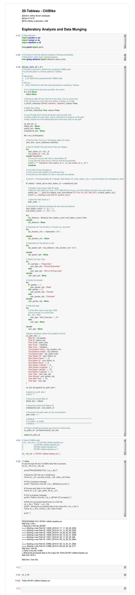

# CitiBike

This application provides an analysis and visualization of CitiBike Usage in the Jersey City Area.

# Technologies Used

* Tableau
* Python for Data Munging

# Reference

* GitHub: https://github.com/daddyjab/CitiBike
* Data Munging (Jupyter Notebook): https://github.com/daddyjab/CitiBike/blob/master/Citibike_Exploration_JAB.ipynb
* Visualization (on Tableau Public): https://public.tableau.com/profile/jeffery.brown#!/vizhome/CitiBike_with_Paths_Idle_Time_JAB_v5/StoryCitiBike
* Tableau file (tbwx): https://github.com/daddyjab/CitiBike/blob/master/CitiBike_with_Paths_Idle_Time_JAB_v5.twbx

# Contributions

* Jeffery Brown: Designed and implemented all code and visualations for this application.
* Data:
    * Citi Bike System Data: https://www.citibikenyc.com/system-data

# Summary

This application provides a visualization of CitiBike usage data for Jersey City, New Jersey for the month of February 2019.  Python and Jupyter Notebook were used to prepare the data for use in Tableau.  The Tableau Deskop applicable was used to create visualization worksheets, dashboards, and a story, which were then uploaded to Tableau Public.

# Data Munging (Python, Jupyter Notebook)
The Jupyter Notebook shown in Figure 1 below used used to:

* `In [4]`: Define a function `gen_paths_df` that
    * Accepts a Pandas DataFrame containing usage data, sorts the data, and generates "paths" that allow Tableau to plot the movement of bikes from one station to the next
    * Calculates useful metrics such as trip straight-line distance based upon the station coordinates, trip duration in minutes (vs. seconds), trip speed, and user age.
    * It then relabels the gender and user type fields to more meaningful terms and creates an output DataFrame with meaningful column labels.

* `In [5]`: Loop through each data file name to read the CSV file into a Pandas DataFrame, process the data using the `gen_paths_df` function, and then write the resulting DataFrame to an output CSV file.

* Even though subsequent data analysis was only performed for February 2019, this data munging was confirmed to work with several of the other larger datasets 

| Figure 1: CitiBike - Data Munging - Jupyter Notebook `Citibike_Exploration_JAB` |
|----------|
| <iframe src="docs/Citibike_Exploration_JAB-snippet.html" width="100%" height="400px" > </iframe> |

|  |

After initial exploration of the data in Tableau, it appeared that having data about how long bikes waited at stations before being used might be helpful.  The Jupyter Notebook shown in Figure 2 below was used to generate this wait time information from the CSV files output from the previous Jupyter notebook.

| Figure 2: CitiBike - Adding Idle Times - Jupyter Notebook `Citibike_Exploration_Wait_Time_JAB` |
|----------|
| <iframe src="docs/Citibike_Exploration_Wait_Time_JAB-snippet.html" width="100%" height="400px" > </iframe> |

# Visualizations (Tableau Desktop, Tableau Public)

A number of Visualizations were created using the Tableau Desktop application and can be seen in the Tableau file [`CitiBike_with_Paths_Idle_Time_JAB_v5.twbx`](https://github.com/daddyjab/CitiBike/blob/master/CitiBike_with_Paths_Idle_Time_JAB_v5.twbx).  A subset of these were subsequently arranged into a Tableau Story and uploaded to [Tableau Public](https://public.tableau.com/profile/jeffery.brown#!/vizhome/CitiBike_with_Paths_Idle_Time_JAB_v5/StoryCitiBike).

Figure 3 below shows a Tableau interactive Dashboard using Tableau Desktop on a large screen monitor.

| Figure 3: CitiBike - Interactive Dashboard Visualization using Tableau Desktop |
|----------|
|  |

Figure 4 below shows a Tableau Story as viewed on Tableau Public. 
Note: This visualization was designed with the smaller portrait-mode screen size supported by Tableau Public. 

| Figure 4: CitiBike - Interactive Story Visualization using Tableau Public |
|----------|
|  |
